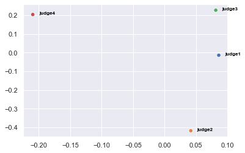
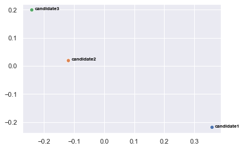

# Ranky

#### Compute rankings in Python.

[](https://travis-ci.com/Didayolo/ranky)


# Get started

```bash
pip install ranky
```
```python
import ranky as rk
```

Read the **[documentation](https://didayolo.github.io/ranky/)**.

# Main functions

The main functionalities include **scoring metrics** (e.g. accuracy, roc auc), **rank metrics** (e.g. Kendall Tau, Spearman correlation), **ranking systems** (e.g. Majority judgement, Kemeny-Young method) and some **measurements** (e.g. Kendall's W coefficient of concordance).

Most functions takes as input 2-dimensional `numpy.array` or `pandas.DataFrame` objects. DataFrame are the best to keep track of the names of each data point.

Let's consider the following preference matrix:


Each row is a candidate and each column is a judge. Here is the results of `rk.borda(matrix)`, computing the mean rank of each candidate:


We can see that candidate2 has the best average rank among the four judges.

Let's display it using `rk.show(rk.borda(matrix))`:


## Ranking systems

The rank aggregation methods available include:

* Random Dictator: `rk.dictator(m)`
* Score Voting: `rk.score(m)`
* Borda Count: `rk.borda(m)`
* Majority Judgement: `rk.majority(m)`
* Condorcet, p-value Condorcet: `rk.condorcet(m)`, `rk.condorcet(m, wins=rk.p_wins)`
* **Optimal rank aggregation** using any rank metric: `rk.center(m)`, `rk.center(m, method='kendalltau')`. Solver used \[1\].
* _(Kemeny-Young method is optimal rank aggregation using Kemeny distance as metric.)_
* _(Optimal rank aggregation using Spearman correlation as metric is equivalent to Borda count.)_


## Metrics

You can use `any_metric(a, b, method)` to call a metric from **any** of the three categories below.

* **Scoring metrics**: `rk.metric(y_true, y_pred, method='accuracy')`. Methods include: `['accuracy', 'balanced_accuracy', 'precision', 'average_precision', 'brier', 'f1_score', 'mxe', 'recall', 'jaccard', 'roc_auc', 'mse', 'rmse', 'sar']`

* **Rank correlation coefficients**: `rk.corr(r1, r2, method='spearman')`. Methods include: `['kendalltau', 'spearman', 'pearson']`

* **Rank distances**: `rk.dist(r1, r2, method='levenshtein')`. Methods include: `['hamming', 'levenshtein', 'winner', 'euclidean']`


_To add: general edit distances, kemeny distance, regression metrics..._


## Visualizations

* Use `rk.show` to visualize preference matrix (2D) or ranking ballots (1D).

`>>> rk.show(m)`


`>>> rk.show(m['judge1'])`


* Use `rk.mds`, to visualize (in 2D or 3D) the points in a given metric space. _See `rk.scatterplot` documentation for display arguments._

`>>> rk.mds(m, method='euclidean')`



`>>> rk.mds(m, method='spearman', axis=1)`



* You can use `rk.tsne` similarly to `rk.mds`.


## Other

* Rank, `rk.rank`, convert a 1D score ballot into a ranking.
* Bootstrap, `rk.bootstrap`, sample a given axis.
* Consensus, `rk.consensus`, check if ranking exactly agree.
* Concordance, ,`rk.concordance`, mean rank distance between all judges of a preference matrix.
* Centrality, `rk.centrality`, mean rank distance between a ranking and a preference matrix.
* Kendall's W, `rk.kendall_w`, coefficient of concordance.
* Utility: `read_codalab_csv` to parse a CSV generated by Codalab representing a leaderboard into a `pandas.DataFrame`.


\[1\] Storn R. and Price K., Differential Evolution - a Simple and Efficient Heuristic for Global Optimization over Continuous Spaces, Journal of Global Optimization, 1997, 11, 341 - 359.
