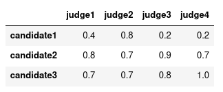
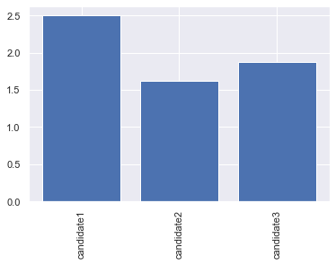

# Ranky

#### Compute rankings in Python.

[](https://travis-ci.com/Didayolo/ranky)


# Get started

```bash
pip install ranky
```
```python
import ranky as rk
```

Read the [documentation](https://didayolo.github.io/ranky/).

# Main functions

The main functionalities include **scoring metrics** (e.g. accuracy, roc auc), **rank metrics** (e.g. Kendall Tau, Spearman correlation), **ranking systems** (e.g. Majority judgement, Kemeny-Young method) and some **measurements** (e.g. Kendall's W coefficient of concordance).

Most functions takes as input 2-dimensional `numpy.array` or `pandas.DataFrame` objects. DataFrame are the best to keep track of the names of each data point.

Let's consider the following preference matrix:



Each row is a candidate and each column is a judge. Here is the results of `rk.borda(matrix)`, computing the mean rank of each candidate:

 

We can see that candidate2 has the best average ranking among the four judges.

Let's display it using `rk.show(rk.borda(matrix))`:



## Ranking systems

Rank aggregation methods available:

* Random Dictator. `rk.dictator(m)`
* Score Voting. `rk.score(m)`
* Borda Count. `rk.borda(m)`
* Majority Judgement. `rk.majority(m)`
* Condorcet, p-value Condorcet. `rk.condorcet(m)`, `rk.condorcet(m, wins=rk.p_wins)`

* Center. `rk.center(m)`, `rk.center(m, method='swap')`, etc.
* Kemeny.

## Metrics

* Scoring metrics. `rk.metric(y_true, y_pred, method='accuracy')`

* Rank correlation coefficients. `rk.corr(r1, r2, method='spearman')`

* Rank distances. `rk.dist(r1, r2, method='levenshtein')`

* To fix: `any_metric(a, b, method)`


## Visualizations

* Use `rk.show` to visualize preference matrix (2D) or ranking ballots (1D).

`rk.show(m)`


`rk.show(m['judge1'])`


* Use `rk.mds`, to visualize (in 2D or 3D) the points in a given metric space.

`rk.mds(m, method='euclidean')`


`rk.mds(m, method='spearman', axis=1)`


* You can use `rk.tsne` similarly to `rk.mds`.


## Other

* Rank
* Bootstrap
* Consensus
* Concordane
* Centrality
* Kendall's W

